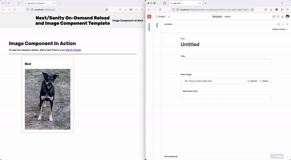

<section class="intro">
  <h1>Next/Sanity Project Template</h1>
  <hr></hr>
  <p>This repo is a project template for Next/Sanity projects. The two features that I find myself re-using project-to-project are the tag-based revalidation on the <code>api/revalidate</code> route and the <code>ClientImag.jsx</code>.</p>
  <p>Please plunder this resource (and share any issues). If you've never built a Next/Sanity project, follow the steps to get going.</p>
  <h3>End Result:</h3>
  <div> 
    
  </div>
  <br/>
</section>
<section id="sanity-setup" className={styles.sanitySetup}>
    <h2>Setting Up Sanity</h2>
    <p>Create a Sanity project at <a href="https://www.sanity.io" target="_blank">https://www.sanity.io</a>. If you haven't made a Sanity account already, do that first. The free tier will work for all this.</p>
    <p>Creat a <code>.env</code> file at the root level of your project. Paste in the following:</p>
    ```
      NEXT_PUBLIC_SANITY_PROJECT_ID="&lt;&gt;YOUR_SANITY_PROJECT_ID&lt;&gt;"<br/>
      NEXT_PUBLIC_SANITY_DATASET="&lt;&gt;YOUR_SANITY_DATASET_TITLE&lt;&gt;"
    ```
    <p>Make sure to replace <code>YOUR_SANITY_PROJECT</code> and <code>YOUR_SANITY_DATASET_TITLE</code> with those actual values!</p>
    <div className={styles.imageContainer}>
      
    </div>
  </section>

Create a Sanity project at [https://www.sanity.io/](https://www.sanity.io/).
Create a `.env` file and paste in the following:
```
NEXT_PUBLIC_SANITY_PROJECT_ID="<>YOUR_SANITY_PROJECT_ID<>"
NEXT_PUBLIC_SANITY_DATASET="<>YOUR_SANITY_DATASET_TITLE<>"
```

Install [localtunnel](https://github.com/localtunnel/localtunnel#readme). You can install globally or as a local dependency; I recommend globally because you're likely to continue using it!

localtunnel will allow us to use a revalidation webhook that rebuilds our refreshes the site when new content is loaded to the content lake. Having the site hot-reload when content is uploaded speeds up the development process.

Let's start building:

Start your dev server with `npm run dev`. In another terminal at project-level, run `lt -p 3000`. This is going to expose our localhost so that we can test out, and work with, the revalidation hook we're about to create. Copy the url localtunnel spits out.

Back in your Sanity project console, navigate to API


Select the appropriate dataset from the dropdown menu (*(all datasets) will also work). Otherwise, match your webhook config to the following:


Paste that localtunnel URL into the text field labeld <strong>URL</strong> and make sure to append it with `/api/revalidate`.

We want the hook to trigger on Create, Update and Delete actions. To work, the webhook should also be enabled, so make sure that box is checked. And the HTTP method we'll be using is POST.

Before clicking "Save", create a secret and copy it.

Back in your `.env` file, add the following:
```
SANITY_WEBHOOK_SECRET="<>YOUR_WEBHOOK_SECRET<>"
```